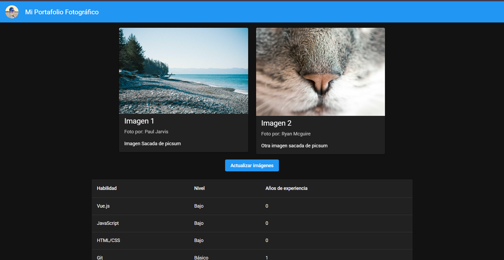

# Mi Portafolio Fotográfico

Aplicación Vue 3 + Vuetify 3 que consume la API de Picsum para mostrar imágenes aleatorias.

## Captura de pantalla

## Tecnologías
- Vue 3 (Composition API)
- Vuetify 3
- Vite
- Picsum API

## Instalación
\`\`\`bash
pnpm install  
pnpm run dev
\`\`\`

## Estructura del proyecto
proyecto-vue-vuetify/ 
│ 
├── public/ 
│   └── favicon.ico                # Ícono de la pestaña del navegador 
│ 
├── src/ 
│   ├── assets/
│   │   └── logo.png               # Imágenes locales (si usas alguna, opcional) 
│   │ 
│   ├── components/ 
│   │   ├── AppHeader.vue          # Barra superior (v-app-bar) 
│   │   ├── AppFooter.vue          # Pie de página (v-footer) 
│   │   ├── TarjetaConImagen.vue   # Tarjeta reutilizable con props 
│   │   └── TablaDeDatos.vue       # Tabla de habilidades (v-table) 
│   │ 
│   ├── services/ 
│   │   └── picsumApi.js           # (Opcional pero recomendado) centraliza el fetch 
│   │ 
│   ├── plugins/ 
│   │   └── vuetify.js             # Configuración/registro de Vuetify 
│   │ 
│   ├── App.vue                    # Layout raíz: Header + main + Footer 
│   └── main.js                    # Punto de entrada: monta la app Vue 
│ 
├── index.html                     # HTML base donde Vue se "inyecta" 
├── package.json                   # Dependencias y scripts (pnpm run dev, etc.) 
├── .gitignore 
└── README.md 